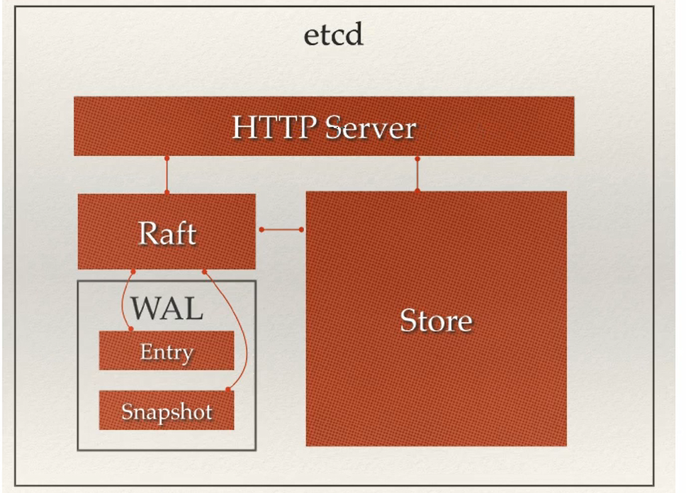

#ETCD

###raft
###zookeeper

etcd使用场景
服务注册发现

从etcd架构图中我们可以看到，etcd的主要部分

    Http Server用于处理用户的发送的API请求以及其他etcd节点的同步与心跳信息请求
  
    Store：用于处理etcd支持的各类功能的事务，包括数据的搜索，节点转化变更，监控与反馈。事件
    处理与执行等等是etcd对用户提供的大多数api功能的具体实现
    
    Raft：强一致性算法的核心，是etcd的核心
    
    WAL：write AheadLog（预写式日志） 是etcd的数据储存方式，除了在内存中存有所有数据
    的状态以及节点的索引意外，etcd通过WAL进行持久化的存储WAL中，所有的数据提交前都会记录日志中，
    Snaphot是为了防止数据过多而进行 的状态快照，Entry表示数据数据存储的具体内容
    