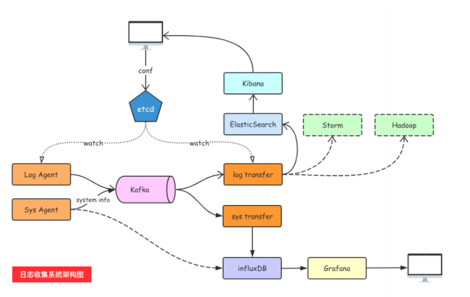

# day12课上笔记


# 内容回顾

## go module

依赖管理工具。

## context

goroutine管理。

`context.Context`

两个根节点：`context.Background()`、`context.TODO()`

四个方法：`context.WithCancel()`、`context.WithTimeout()`、`context.WithDeadline()`、`context.WithValue()`

## 日志收集项目

### 为什么要自己写不用ELK?

ELK: 部署的时候麻烦每一个filebeat都需要配置一个配置文件

使用etcd来管理被收集的日志项。

### 项目的架构



### 上节课项目进度

1. kafka：消息队列
2. tailf：从文件里读日志
3. go-ini：解析配置文件


# 今日内容

## etcd

### etcd介绍

详见群文件：etcd.pdf

### 安装etcd

详见：https://docs.qq.com/doc/DTndrQXdXYUxUU09O

### go操作etcd

命令行操作：使用自带的`etcdctl`

注意一定要使用V3版本的API

先设置环境变量：

```bash
SET ETCDCTL_API=3 // Windows
export ETCDCTL_API=3 // Mac&Linux
```

PUT：

```bash
etcdctl.exe --endpoints=http://127.0.0.1:2379 put key value
```

GET：

```bash
etcdctl.exe --endpoints=http://127.0.0.1:2379 GET key
```

DEL:

```bash
etcdctl.exe --endpoints=http://127.0.0.1:2379 DEL key
```


go mod设置代理：

```bash
SET GOPROXY=https://goproxy.cn // Windows
export GOPROXY=https://goproxy.cn // Mac&Linux
```


#### PUT/GET

```go
package main
import (
	"context"
	"fmt"
	"time"
	"go.etcd.io/etcd/clientv3"
)
// etcd client put/get demo
// use etcd/clientv3
func main() {
	cli, err := clientv3.New(clientv3.Config{
		Endpoints: []string{"127.0.0.1:2379"},
		DialTimeout: 5 * time.Second,
	})
	if err != nil {
		// handle error!
		fmt.Printf("connect to etcd failed, err:%v\n", err)
		return
	}
	fmt.Println("connect to etcd success")

	defer cli.Close()

	// put
	ctx, cancel := context.WithTimeout(context.Background(), time.Second)
	_, err = cli.Put(ctx, "baodelu", "dsb")
	cancel()
	if err != nil {
		fmt.Printf("put to etcd failed, err:%v\n", err)
		return
	}
	// get
	ctx, cancel = context.WithTimeout(context.Background(), time.Second)
	resp, err := cli.Get(ctx, "baodelu")
	cancel()
	if err != nil {
		fmt.Printf("get from etcd failed, err:%v\n", err)
		return
	}
	for _, ev := range resp.Kvs {
		fmt.Printf("%s:%s\n", ev.Key, ev.Value)
	}
}
```

#### watch

非常重要

```go
package main

import (
	"context"
	"fmt"
	"go.etcd.io/etcd/clientv3"
	"time"
)
// etcd watch


func main() {
	cli, err := clientv3.New(clientv3.Config{
		Endpoints: []string{"127.0.0.1:2379"},
		DialTimeout: 5 * time.Second,
	})
	if err != nil {
		// handle error!
		fmt.Printf("connect to etcd failed, err:%v\n", err)
		return
	}
	fmt.Println("connect to etcd success")

	defer cli.Close()
	// watch
	// 派一个哨兵 一直监视着 luminghui 这个key的变化（新增、修改、删除）
	ch := cli.Watch(context.Background(), "luminghui")
	// 从通道尝试取值(监视的信息)
	for wresp := range ch{
		for _, evt := range wresp.Events{
			fmt.Printf("Type:%v key:%v value:%v\n", evt.Type, string(evt.Kv.Key), string(evt.Kv.Value))
		}
	}
}
```

## 使用etcd优化日志收集项目


# 本周任务

1. Raft协议 

   1. 选举
   2. 日志复制机制
   3. 异常处理（脑裂）
   4. zookeeper的zad协议的区别

   