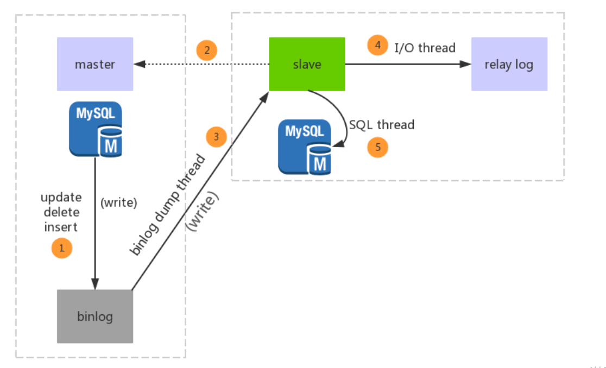
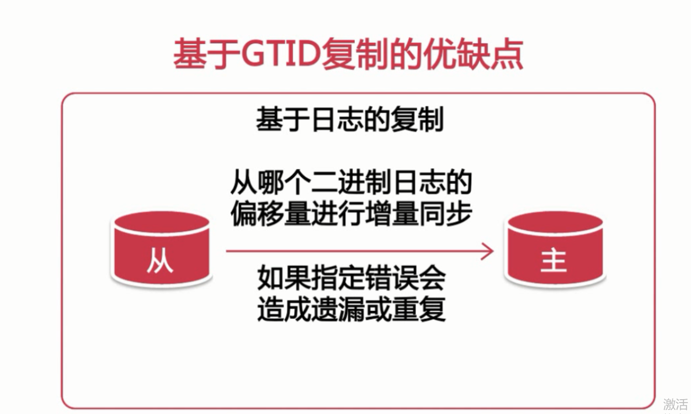
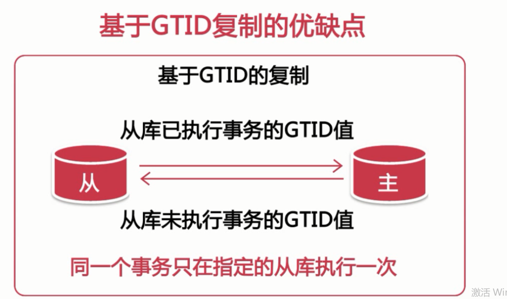
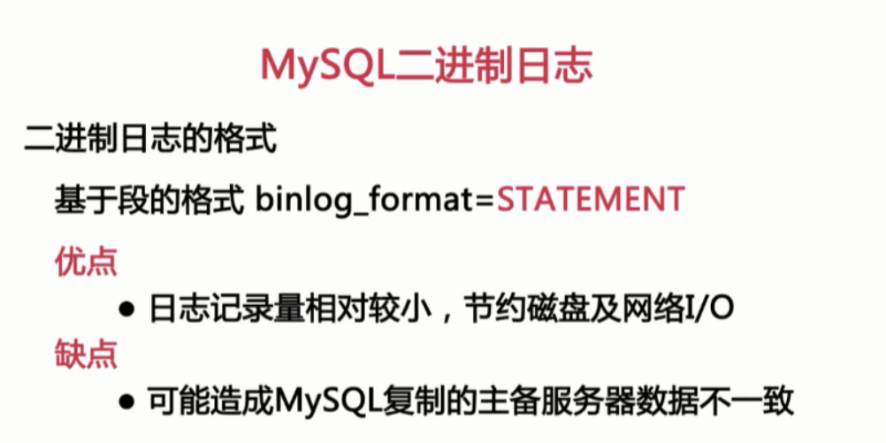
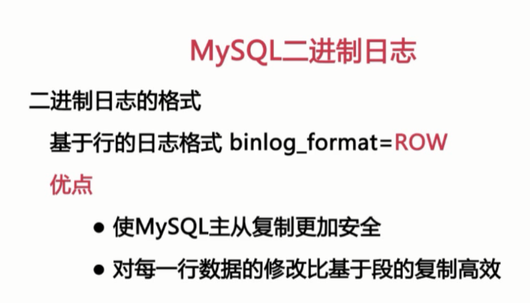
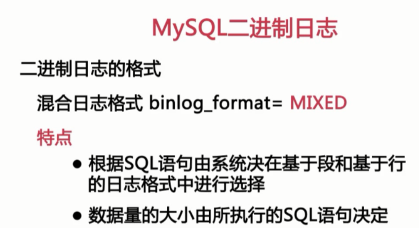
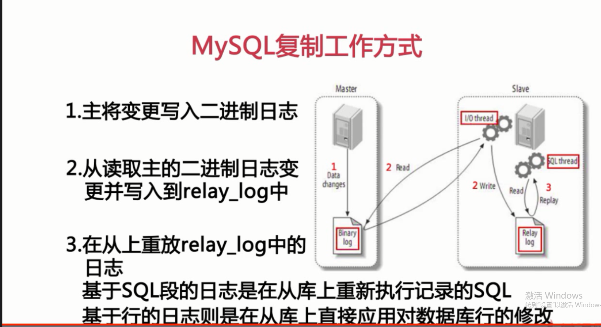

#Mysql面试问题集锦

#1.1Mysql索引
索引分别有哪些优点和缺点
    快速访问数据表中的特定信息，提高检索速度。
    创建唯一性索引，保证数据表中每一行数据的唯一性
    加速表与表之间的连接。
    使用分组和排序进行数据检索时，可以显著减少查询中分组和排序的时间。
    
    索引的缺点：
    虽然提高了的查询速度，但却降低了更新表的速度，比如 update、insert，因为更新数据
    时，MySQL 不仅要更新数据，还要更新索引文件；
    建立索引会占用磁盘文件的索引文件
    使用短索引，短索引不仅可以提高查询速度，更能节省磁盘空间和 I/O 操作
    索引列排序，MySQL 查询只使用一个索引，因此如果 where 子句中已经使用了索引的话，那么 order by 中的列是不会使用索引的，因此数据库默认排序可以符合要求的情况下，不要进行排序操作；尽量不要包含多个列的排序，如果需要最好给这些列创建复合索引；
    like 语句操作，一般情况下不鼓励使用 like 操作，如果非使用不可， 注意 like "%aaa%" 不会使用索引，而like "aaa%"可以使用索引；
    不要在列上进行运算；
    不适用 NOT IN 和 <> 操作。
#1.2Mysql日志
#1.3Mysql事务
#1.4Mysql中SQl语句优化
sql语句的执行顺序
https://www.cnblogs.com/yuanshuo/p/11549251.html
#1.5Mysql主从复制

    MySQL主从复制的流程
    Mysql二进制的日志格式
    Mysql基于复制

MySQL主从复制的流程

1.主库db的更新事件(update、insert、delete)被写到binlog

2.主库创建一个binlog dump thread，把binlog的内容发送到从库

3.从库启动并发起连接，连接到主库

4从库启动之后，创建一个I/O线程，读取主库传过来的binlog内容并写入到relay log

5.从库启动之后，创建一个SQL线程，从relay log里面读取内容，从Exec_Master_Log_Pos位置开始执行读取到的更新事件，将更新内容写入到slave的db

Mysql基于复制的方式

基于日志节点的复制

基于GTID的复制

#1.6Mysql分库分表

#其他
说一下 MySQL 执行一条查询语句的内部执行过程？
    
    客户端先通过连接器连接到 MySQL 服务器。
    连接器权限验证通过之后，先查询是否有查询缓存，如果有缓存（之前执行过此语句）则直接返回缓存数据，如果没有缓存则进入分析器
    分析器会对查询语句进行语法分析和词法分析，判断 SQL 语法是否正确，如果查询语法错误会直接返回给客户端错误信息，如果语法正确则进入优化器
    优化器是对查询语句进行优化处理，例如一个表里面有多个索引，优化器会判别哪个索引性能更好
    优化器执行完就进入执行器，执行器就开始执行语句进行查询比对了，直到查询到满足条件的所有数据，然后进行返回。

