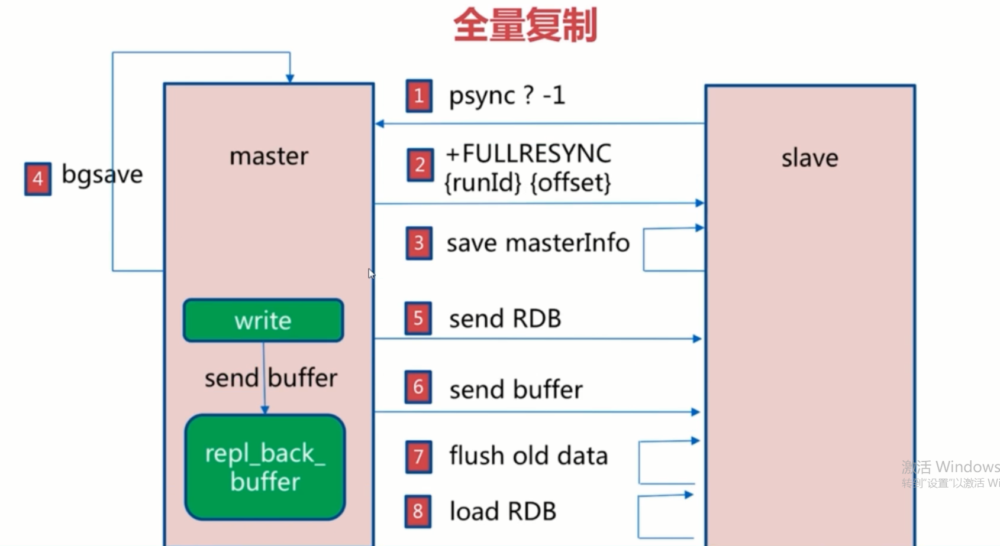

#1.Redis面试问题集锦

##1.1 Redis的数据类型与相关指令以及应用场景
        1.1.1  string
        1.1.2  hash
        1.1.3  list
        1.1.4  set
        1.1.5  zset
 
通用指令
 keys *
 keys []
###1.1.1  string
###1.1.2  hash
###1.1.3  list
    LPUSH/LPUSHX
    RPUSH/RPUSHX
    LPOP
    RPOP
    LTRIM  保定指定区间内的元素
    LLEN   获取列表的长度
    LSET   通过索引设置列表元素的值
    LINDEX 通过索引获取列表中的元素
    LRANGE 获取列表指定范围的元素
###1.1.4  set
###1.1.5  zset
  

##1.2 Redis的特殊数据类型与相关指令以及应用场景
    
     1.2.1 慢查询日志   
     1.2.2 bitmap   
     1.2.3 发布/订阅   
     1.2.4 HyperLogLog   
     1.2.4 Geo   
     1.2.4 Streams
     
##1.3 Redis 持久化
    
       1.3.1 rdb   
       1.3.2 aof   
       
##1.4 Redis 主从复制

    1.4.1 主从复制的原理与优化
 
###1.4.1 主从复制的原理与优化
    
    什么是主从复制
    复制的配置
    全量复制和部分复制
    故障处理
    常见运维问题  
 
redis主从复制的原理   

  
1.psync?(runid+offset)-1
2,fullresync(runid+offset)
3.save masterInfo
4.bgsave
5.send RDB
6.send buffer
7.flush old data
8.load RDB
 
##1.5 Redis 哨兵模式sentine
    1.5.1 主观下线
    1.5.2 客观下线

##1.6 Redis 集群模式

###杂项
    
#####Reids淘汰策略有哪些？
#####缓存和数据库间数据一致性问题
#####Redis分布式锁实现
#####Redis中海量数据的正确操作方式
#####Redis雪崩与击穿问题

10.   缓存和数据库间数据一致性问题
分布式环境下非常容易出现缓存和数据库间的数据一致性 问题，针对这一点的话，如果你的项目对缓存的要求是强一致性的，那么请不要使用缓存。只能釆取合适的策略来 降低缓存和数据库间数据不一致的概率，而无法保证两者 间的强一致性。合适的策略包括合适的缓存更新策略，更 新数据库后要及时更新缓存、缓存失败时增加重试机制，例如MQ模式的消息队列

16.   Redis做异步队列
一般使用list结构作为队列，rpush生产消息，Ipop消费消息。当Ipop没有消息的时候，要适当sleep一会再重 试。缺点：在消费者下线的情况下，生产的消息会丢失，得使用专业的消息队列如rabbitmq等。能不能生产一次 消费多次呢？使用pub/sub主题订阅者模式，可以实现1:N的消息队列。
10.   缓存和数据库间数据一致性问题
分布式环境下非常容易出现缓存和数据库间的数据一致性 问题，针对这一点的话，如果你的项目对缓存的要求是强一致性的，那么请不要使用缓存。只能釆取合适的策略来 降低缓存和数据库间数据不一致的概率，而无法保证两者 间的强一致性。合适的策略包括合适的缓存更新策略，更 新数据库后要及时更新缓存、缓存失败时增加重试机制，例如MQ模式的消息队列