#1.1.1. kafka搭建

注意:我的电脑是win10的以下都是基于win10的安装

kafka环境基于zookeeper,zookeeper环境基于JAVA-JDK。

###1.1.2. 安装JAVA-JDK

下载地址：https://www.oracle.com/technetwork/java/javase/downloads/jdk12-downloads-5295953.html

安装JDK

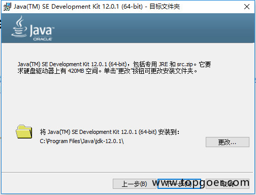

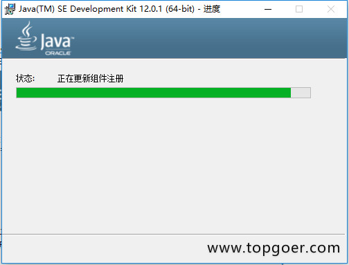

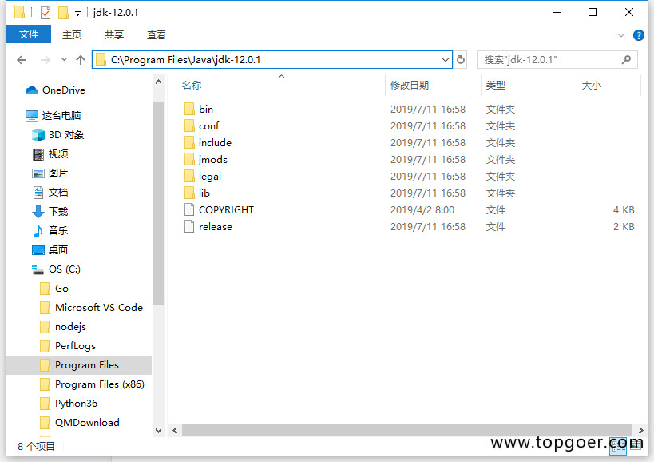

添加环境变量

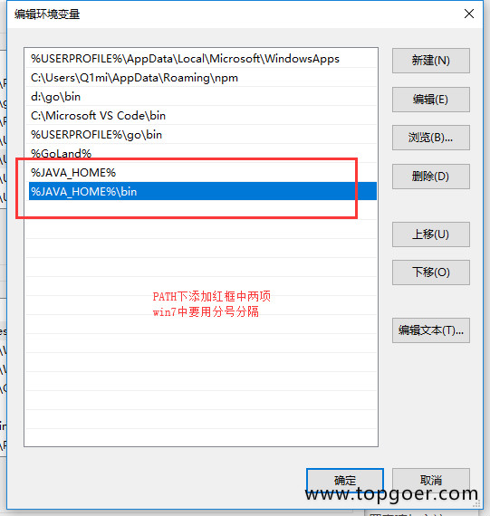

注意 : 第二部本来需要安装zookeeper的但是现在kafka上面自带这个了！可以安装可以不安装！我不找刺激就不安装了！

###1.1.3. 安装kafka

下载
下载地址：http://kafka.apache.org/downloads 下载kafka_2.12-2.3.0.tgz。

安装

将下载好的压缩包解压到本地即可。

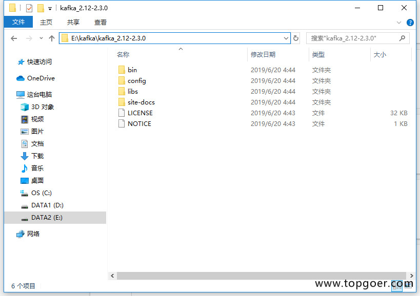

配置

            1.打开config目录下的server.properties文件
            2.修改log.dirs=E:\\kafkalogs
            3.打开config目录下的zookeeper.properties文件
            4.修改dataDir=E:\\kafka\\zookeeper
            

启动

注意 : 记得啊执行cmd记得以管理员的身份启动不然启动不了！两次都需要管理员身份（另外记得走到kafka你解压的目录执行下面的命令啊

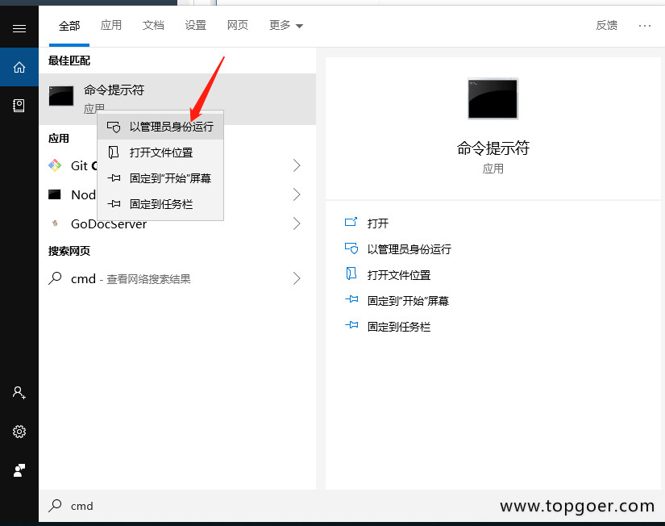

         先执行：bin\windows\zookeeper-server-start.bat config\zookeeper.properties
        
         再执行：bin\windows\kafka-server-start.bat config\server.properties
         

###1.1.4. 进行单机实例测试简单使用

windows使用的是路径E:\Kafka\kafka_2.12-2.0.0\bin\windows下批处理命令，如有问题，参见

步骤：

####1）启动kafka内置的zookeeper
.\bin\windows\zookeeper-server-start.bat .\config\zookeeper.properties

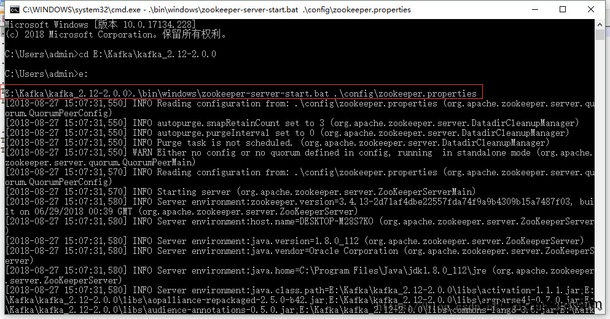

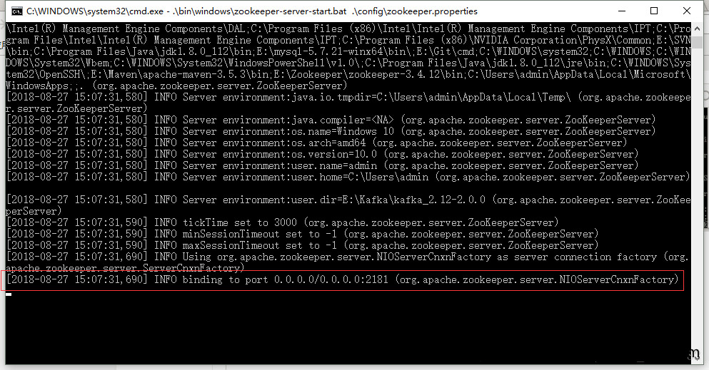

出现binding to port ...表示zookeeper启动成功，不关闭页面

####2）kafka服务启动 ，成功不关闭页面

####3）创建topic测试主题kafka，成功不关闭页面

####4）创建生产者产生消息，不关闭页面

.\bin\windows\kafka-console-producer.bat --broker-list localhost:9092 --topic test

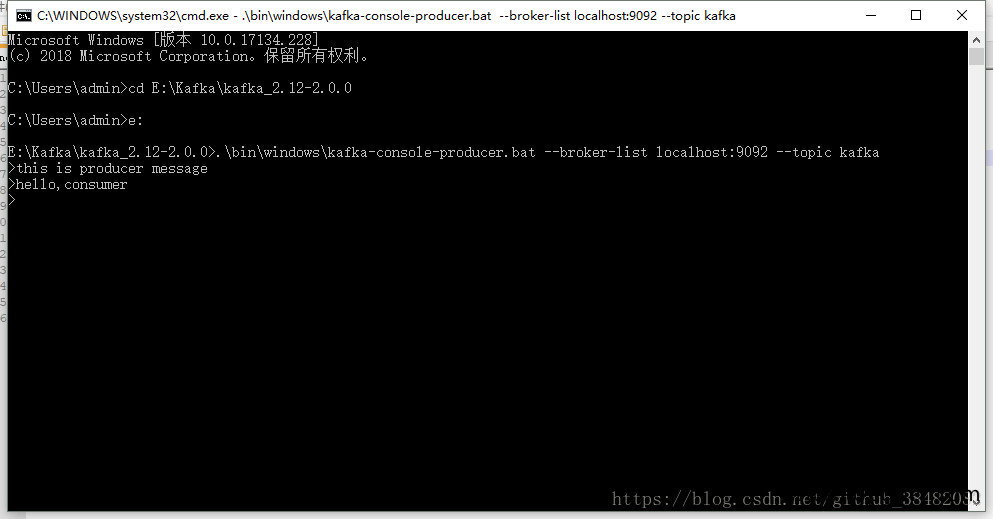

####5）创建消费者接收消息，不关闭页面

.\bin\windows\kafka-console-consumer.bat --bootstrap-server localhost:9092 --topic test --from-beginning

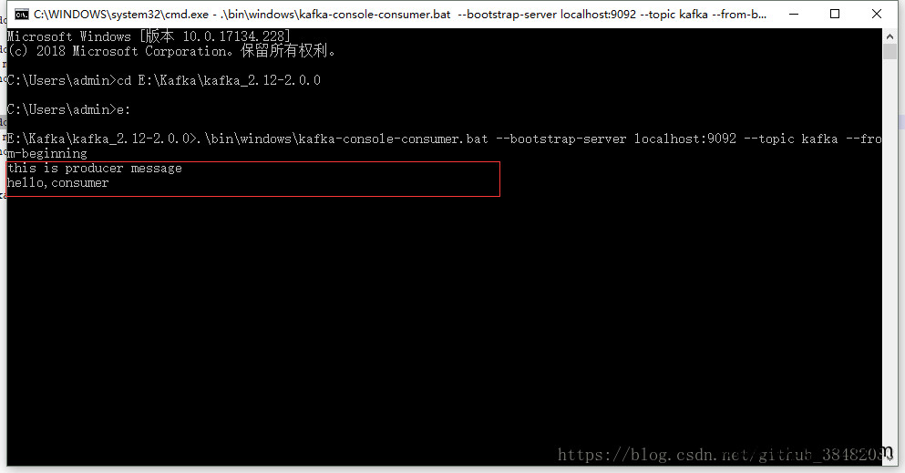

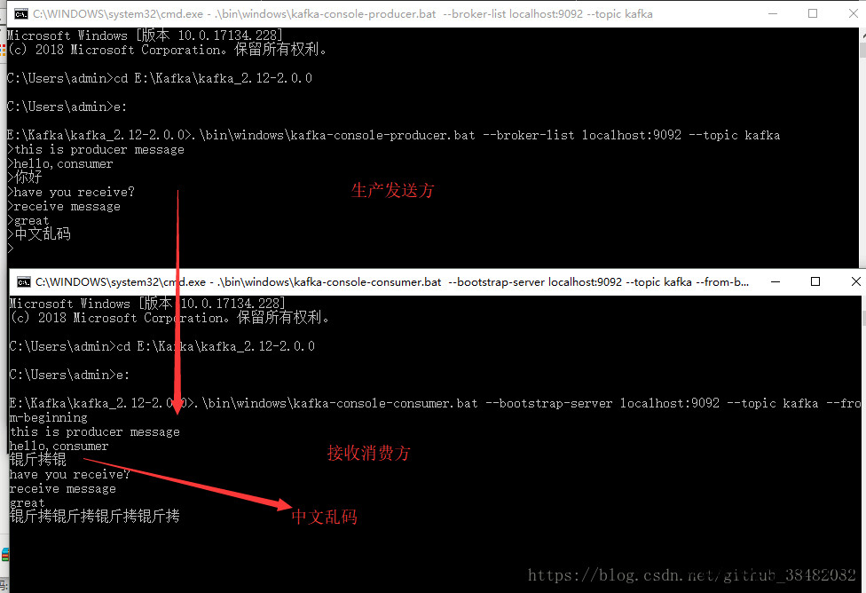