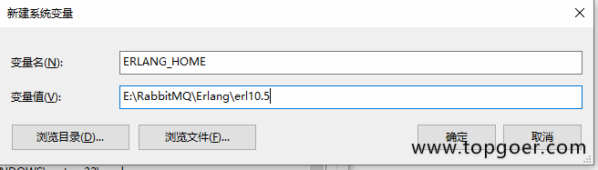
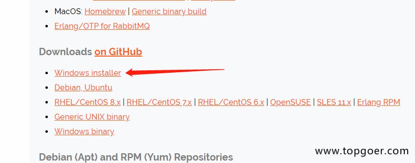

#1. RabbitMQ安装

###1.1.1. win下安装

第一步：下载并安装erlang

* 原因：RabbitMQ服务端代码是使用并发式语言Erlang编写的，安装Rabbit MQ的前提是安装Erlang。
* 下载地址：http://www.erlang.org/downloads

根据本机位数选择erlang下载版本。

* 下载完是这么个东西：

* 双击，点next就可以。

* 选择一个自己想保存的地方，然后next、finish就可以

* 安装完事儿后要记得配置一下系统的环境变量。 此电脑-->鼠标右键“属性”-->高级系统设置-->环境变量-->“新建”系统环境变量

变量名：ERLANG_HOME

变量值就是刚才erlang的安装地址，点击确定。

* 然后双击系统变量path

点击“新建”，将%ERLANG_HOME%\bin加入到path中。

* 最后windows键+R键，输入cmd，再输入erl，看到版本号就说明erlang安装成功了。

第二步：下载并安装RabbitMQ

* 下载地址：http://www.rabbitmq.com/download.html

* 双击下载后的.exe文件，安装过程与erlang的安装过程相同。

* RabbitMQ安装好后接下来安装RabbitMQ-Plugins。打开命令行cd，输入RabbitMQ的sbin目录。

我的目录是：E:\RabbitMQ\rabbitmq_server-3.8.1\sbin

然后在后面输入rabbitmq-plugins enable rabbitmq_management命令进行安装

如果出现下面的提示表示运行成功

输入命令：rabbitmq-server.bat

如果出现下面的提示表示启动成功

rabbitmq启动成功，浏览器中http://localhost:15672，

输入guest,guest进入rabbitMQ管理控制台：

注意

上面的安装步骤如果出现下面错误

* 输入rabbitmq-plugins enable rabbitmq_management命令出现

输入rabbitmq-plugins enable rabbitmq_management命令出现

这样的提示解决办法

解决方法：

将 C:\Users\Administrator\.erlang.cookie

同步至C:\Windows\System32\config\systemprofile\.erlang.cookie

同时删除：C:\Users\Administrator\AppData\Roaming\RabbitMQ目录

重新输入rabbitmq-plugins enable rabbitmq_management命令

* 运行命令：rabbitmq-server.bat

如果出现下面的提示：

这个是因为rabbit已经启动了，不能再次启动，通过tasklist指令，发现进程是存在的：

         tasklist | find /i "erl"
         

如果有结果，那么说明已经启动了，通过任务管理器kill掉进程再次启动即可。

ctrl+alt+delete进入任务管理器

右键->结束任务就好了
