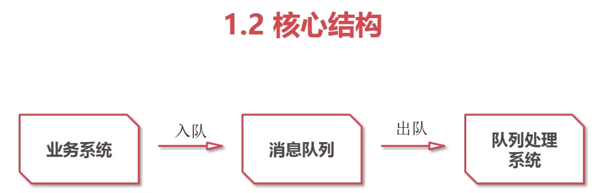
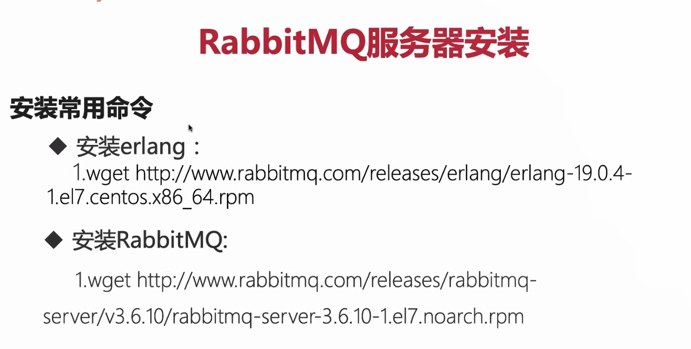

#慕课网视频
php使用rabbitmq
链接地址；https://www.imooc.com/video/15163

视频笔记

###主要内容

消息队列的概念和原理

解耦案例：队列处理订单系统和配送系统
流量销峰：Redis的List类型实现秒杀
rabbitMq:更专业的消息系统实现方案

###1.1概念
队列结构的中间件

消息放入后不需要立即处理

有订阅者、消费者按顺序处理

应用场景

冗余

解耦

流量销峰

异步通信

扩展性

队列介质
mysql 
消息队列中间件

消息处理的触发机制

死循环
定时任务
守护进程

安装

    VirtualHost
    Connection
    Exchange
    Channel
    Queue
    Binding

生产者发送一个消息以后，会首先进入我们的交换机exchange，根据交换机指定的规则绑定对应的key，吧所有消息通过交换机发的送给对应的Key里面