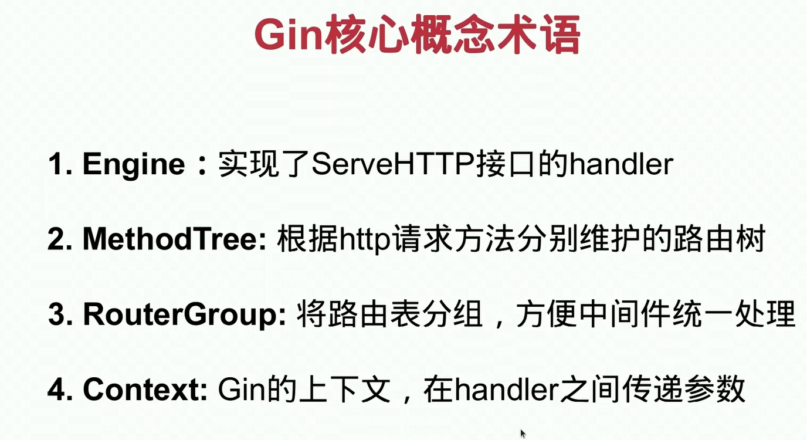
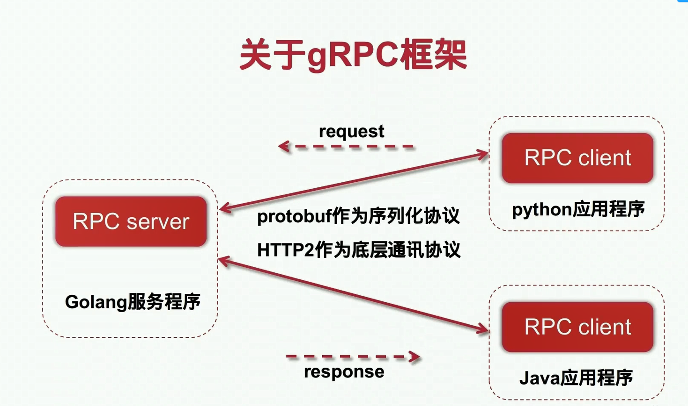
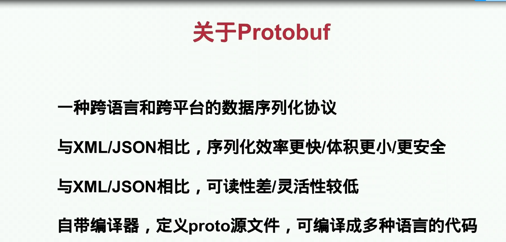
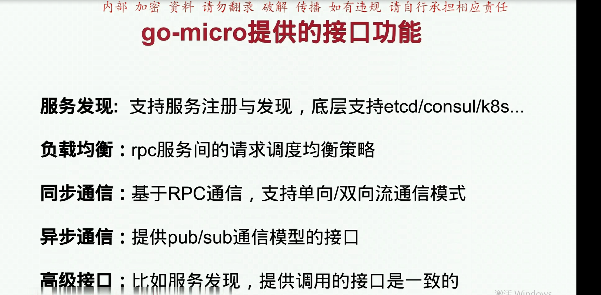
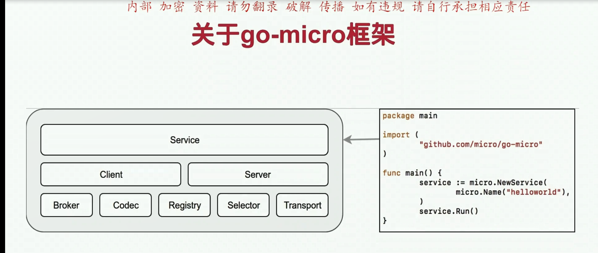

    boker消息通信同步异步
    codec编码
    registery 注册和发现
    selector  负载均衡
    当客户端向服务器发起请求之后，首先去服务发现注册里面去查询服务的注册表，正常情况下得到一个正在运行的节点列表，select通过某种算法，节点循环随机hash提供相应的服务
    transport
    给予rpc通信的接口，
 Client
 
 Server
  
 Service  
