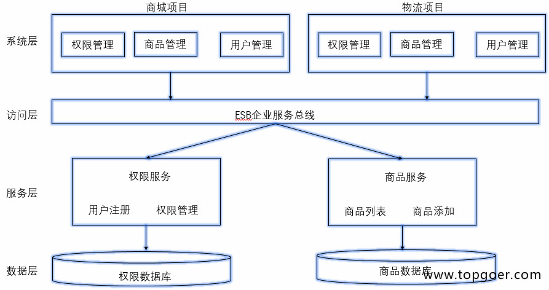

##认识微服务
###1.1.1. 行业背景

不同行业IT系统更新频率

IT系统存在的问题

微服务架构在企业中应用情况

docker在企业中的使用情况

###1.1.2. 什么是微服务
* 使用一套小服务来开发单个应用的方式，每个服务运行在独立的进程里，一般采用轻量级的通讯机制互联，并且它们可以通过自动化的方式部署

* 什么叫微？

  - 单一功能
  - 代码少，不是，而且代码多
  - 架构变的复杂了
  - 微服务是设计思想，不是量的体现
  
###1.1.3. 微服务的特点
* 单一职责，此时项目专注于登录和注册
* 轻量级的通信，通信与平台和语言无关，http是轻量的，例如java的RMI属于重量的
* 隔离性，数据隔离
* 有自己的数据
* 技术多样性

###1.1.4. 微服务诞生背景
* 互联网行业的快速发展，需求变化快，用户数量变化快
* 敏捷开发深入人心，用最小的代价，做最快的迭代，频繁修改、测试、上线
容器技术的成熟，是微服务的技术基础

###1.1.5. 互联网架构演进之路

单体架构

* 所有功能放一个项目里
* 应用和数据库服务器可能部在一起，分开部
*优点：
    - 简单，高效，小型项目
* 缺点：
    - 扛不住
    - 技术栈受限
    
     

####垂直架构

* 将大项目架构拆分成一个一个单体架构
* 优点：
    - 不至于像单体无限扩大
* 缺点：
    - 有瓶颈
    - 成本高
    
####SOA架构，面向服务的编程

* ESB，比较传统的中间件技术
* 优点：
    - 代码提高重用性，ESB接口解耦
    - 针对不同服务，做不同数据层和部署
缺点：
    - ESB比较重量级
    - 对于开发人员来说，系统层和服务层界限模糊

微服务架构

* 每个功能抽取成一个一个的服务
* 微服务之间访问是轻量级的，RPC

###1.1.6. 微服务架构的优势

* 独立性
* 使用者容易理解
* 技术栈灵活
* 高效团队

###1.1.7. 微服务架构的不足
* 额外的工作，服务的拆分
* 保证数据一致性
* 增加了沟通成本
