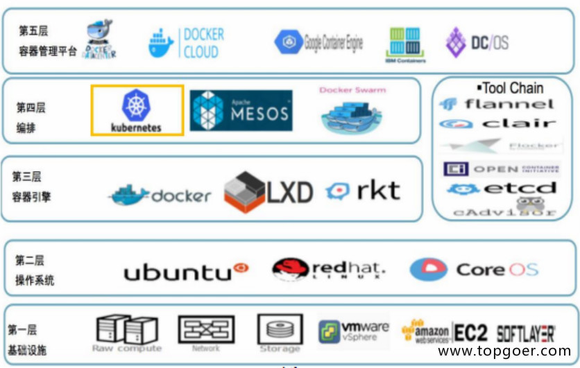
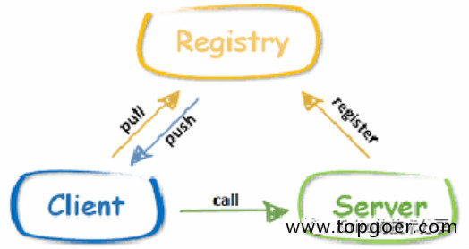

#1. 微服务生态

###1.1.1. 硬件层
用docker+k8s去解决

###1.1.2. 通信层

* 网络传输，用RPC（远程过程调用）

    - HTTP传输，GET POST PUT DELETE

    - 基于TCP，更靠底层，RPC基于TCP，Dubbo（18年底改成支持各种语言），Grpc，Thrift

* 需要知道调用谁，用服务注册和发现

    - 需要分布式数据同步：etcd，consul，zk
    
    
* 数据传递这里面可能是各种语言，各种技术，各种传递
* 效率对比：https://tech.meituan.com/2015/02/26/serialization-vs-deserialization.html

###1.1.3. 应用平台层

* 云管理平台、监控平台、日志管理平台，需要他们支持

* 服务管理平台，测试发布平台

* 服务治理平台

1.1.4. 微服务层

* 用微服务框架实现业务逻辑