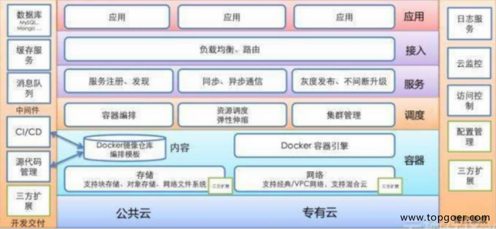
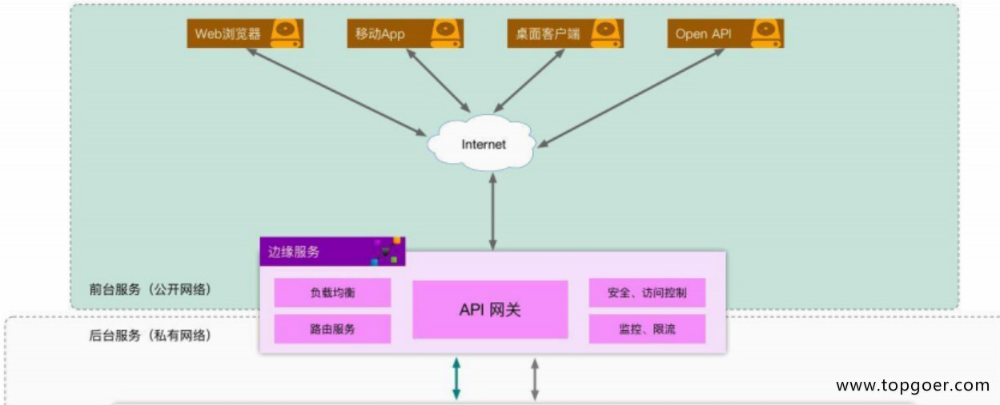
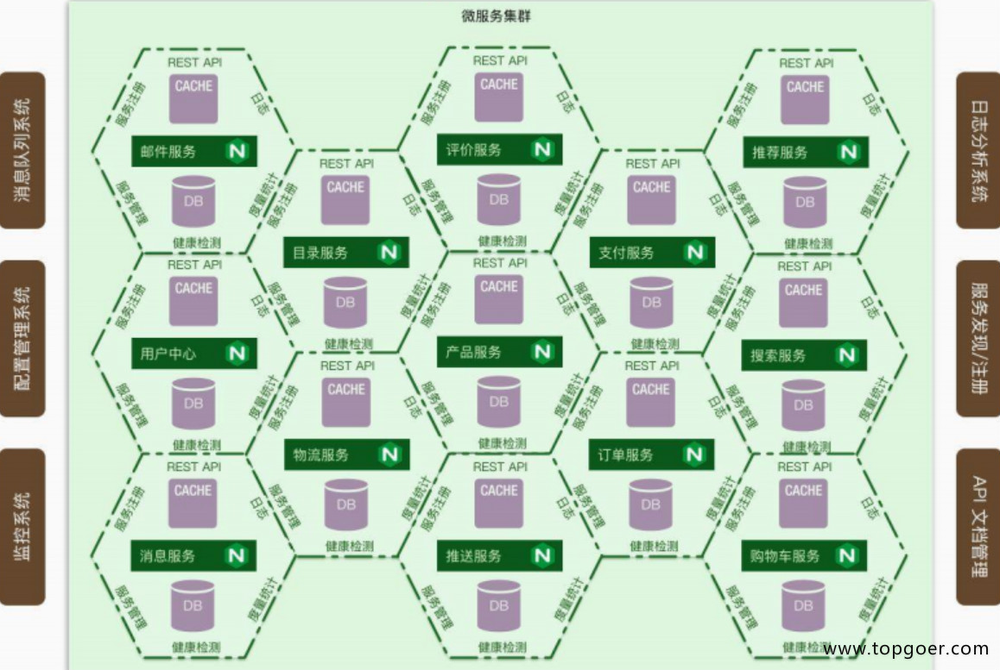
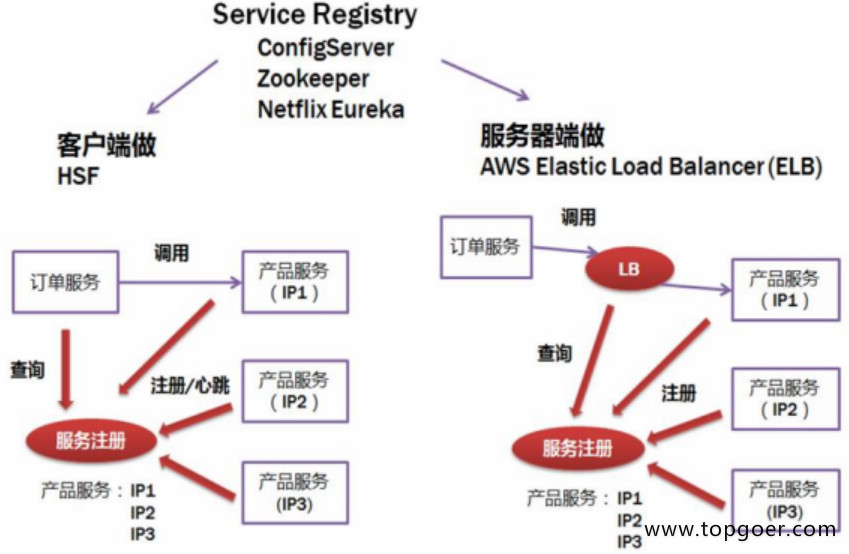

# 微服务详解
###1.1.1. 微服务架构

* 从程序架构来看如下

###1.1.2. 服务注册和发现

* 客户端做，需要实现一套注册中心，记录服务地址，知道具体访问哪个，轮询算法去做，加权轮询
* 服务端做，比较简单，服务端启动，自动注册即可，AWS的ELB去访问

* 微服务一般不用LVS负载，扩展实例需要改配置，不符合微服务弹性扩展思想

* 更多公司倾向于客户端做注册发现

* etcd解决分布式一致性，raft

* etcd使用场景：
    - 注册发现
    - 共享配置  
    - 分布式锁
    - leader选举

### 1.1.3. rpc调用和服务监控

* RPC相关内容
    - 数据传输：JSON Protobuf thrift
    - 负载：随机算法 轮询 一致性hash 加权
    - 异常容错：健康检测 熔断 限流
* 服务监控
    - 日志收集
    - 打点采样