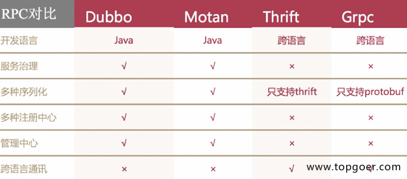

#1. RPC
###1.1.1. RPC简介

* 远程过程调用（Remote Procedure Call，RPC）是一个计算机通信协议
* 该协议允许运行于一台计算机的程序调用另一台计算机的子程序，而程序员无需额外地为这个交互作用编程
* 如果涉及的软件采用面向对象编程，那么远程过程调用亦可称作远程调用或远程方法调用

###1.1.2. 流行RPC框架的对比

###1.1.3. golang中如何实现RPC

* golang中实现RPC非常简单，官方提供了封装好的库，还有一些第三方的库
* golang官方的net/rpc库使用encoding/gob进行编解码，支持tcp和http数据传输方式，由于其他语言不支持gob编解码方式，所以golang的RPC只支持golang开发的服务器与客户端之间的交互
* 官方还提供了net/rpc/jsonrpc库实现RPC方法，jsonrpc采用JSON进行数据编解码，因而支持跨语言调用，目前jsonrpc库是基于tcp协议实现的，暂不支持http传输方式
* 例题：golang实现RPC程序，实现求矩形面积和周长

服务端

    package main
    
    import (
        "log"
        "net/http"
        "net/rpc"
    )
    
    //    例题：golang实现RPC程序，实现求矩形面积和周长
    
    type Params struct {
        Width, Height int
    }
    
    type Rect struct{}
    
    // RPC服务端方法，求矩形面积
    func (r *Rect) Area(p Params, ret *int) error {
        *ret = p.Height * p.Width
        return nil
    }
    
    // 周长
    func (r *Rect) Perimeter(p Params, ret *int) error {
        *ret = (p.Height + p.Width) * 2
        return nil
    }
    
    // 主函数
    func main() {
        // 1.注册服务
        rect := new(Rect)
        // 注册一个rect的服务
        rpc.Register(rect)
        // 2.服务处理绑定到http协议上
        rpc.HandleHTTP()
        // 3.监听服务
        err := http.ListenAndServe(":8000", nil)
        if err != nil {
            log.Panicln(err)
        }
    }
    
客户端

    package main
    
    import (
        "fmt"
        "log"
        "net/rpc"
    )
    
    // 传的参数
    type Params struct {
        Width, Height int
    }
    
    // 主函数
    func main() {
        // 1.连接远程rpc服务
        conn, err := rpc.DialHTTP("tcp", ":8000")
        if err != nil {
            log.Fatal(err)
        }
        // 2.调用方法
        // 面积
        ret := 0
        err2 := conn.Call("Rect.Area", Params{50, 100}, &ret)
        if err2 != nil {
            log.Fatal(err2)
        }
        fmt.Println("面积：", ret)
        // 周长
        err3 := conn.Call("Rect.Perimeter", Params{50, 100}, &ret)
        if err3 != nil {
            log.Fatal(err3)
        }
        fmt.Println("周长：", ret)
    }
    
* golang写RPC程序，必须符合4个基本条件，不然RPC用不了

    - 结构体字段首字母要大写，可以别人调用
    - 函数名必须首字母大写
    - 函数第一参数是接收参数，第二个参数是返回给客户端的参数，必须是指针类型
    - 函数还必须有一个返回值error
    
* 练习：模仿前面例题，自己实现RPC程序，服务端接收2个参数，可以做乘法运算，也可以做商和余数的运算，客户端进行传参和访问，得到结果如下：

服务端代码：

    package main
    
    import (
       "errors"
       "log"
       "net/http"
       "net/rpc"
    )
    
    // 结构体，用于注册的
    type Arith struct{}
    
    // 声明参数结构体
    type ArithRequest struct {
       A, B int
    }
    
    // 返回给客户端的结果
    type ArithResponse struct {
       // 乘积
       Pro int
       // 商
       Quo int
       // 余数
       Rem int
    }
    
    // 乘法
    func (this *Arith) Multiply(req ArithRequest, res *ArithResponse) error {
       res.Pro = req.A * req.B
       return nil
    }
    
    // 商和余数
    func (this *Arith) Divide(req ArithRequest, res *ArithResponse) error {
       if req.B == 0 {
          return errors.New("除数不能为0")
       }
       // 除
       res.Quo = req.A / req.B
       // 取模
       res.Rem = req.A % req.B
       return nil
    }
    
    // 主函数
    func main() {
       // 1.注册服务
       rect := new(Arith)
       // 注册一个rect的服务
       rpc.Register(rect)
       // 2.服务处理绑定到http协议上
       rpc.HandleHTTP()
       // 3.监听服务
       err := http.ListenAndServe(":8000", nil)
       if err != nil {
          log.Fatal(err)
       }
    }
    客户端代码：
    
    package main
    
    import (
       "fmt"
       "log"
       "net/rpc"
    )
    
    type ArithRequest struct {
       A, B int
    }
    
    // 返回给客户端的结果
    type ArithResponse struct {
       // 乘积
       Pro int
       // 商
       Quo int
       // 余数
       Rem int
    }
    
    func main() {
       conn, err := rpc.DialHTTP("tcp", ":8000")
       if err != nil {
          log.Fatal(err)
       }
       req := ArithRequest{9, 2}
       var res ArithResponse
       err2 := conn.Call("Arith.Multiply", req, &res)
       if err2 != nil {
          log.Fatal(err2)
       }
       fmt.Printf("%d * %d = %d\n", req.A, req.B, res.Pro)
       err3 := conn.Call("Arith.Divide", req, &res)
       if err3 != nil {
          log.Fatal(err3)
       }
       fmt.Printf("%d / %d 商 %d，余数 = %d\n", req.A, req.B, res.Quo, res.Rem)
    }
    

另外，net/rpc/jsonrpc库通过json格式编解码，支持跨语言调用

服务端代码：

    package main
    
    import (
        "fmt"
        "log"
        "net"
        "net/rpc"
        "net/rpc/jsonrpc"
    )
    
    type Params struct {
        Width, Height int
    }
    type Rect struct {
    }
    
    func (r *Rect) Area(p Params, ret *int) error {
        *ret = p.Width * p.Height
        return nil
    }
    func (r *Rect) Perimeter(p Params, ret *int) error {
        *ret = (p.Height + p.Width) * 2
        return nil
    }
    func main() {
        rpc.Register(new(Rect))
        lis, err := net.Listen("tcp", ":8080")
        if err != nil {
            log.Panicln(err)
        }
        for {
            conn, err := lis.Accept()
            if err != nil {
                continue
            }
            go func(conn net.Conn) {
                fmt.Println("new client")
                jsonrpc.ServeConn(conn)
            }(conn)
        }
    }
    
客户端代码：
    
    package main
    
    import (
        "fmt"
        "log"
        "net/rpc/jsonrpc"
    )
    
    type Params struct {
        Width, Height int
    }
    
    func main() {
        conn, err := jsonrpc.Dial("tcp", ":8080")
        if err != nil {
            log.Panicln(err)
        }
        ret := 0
        err2 := conn.Call("Rect.Area", Params{50, 100}, &ret)
        if err2 != nil {
            log.Panicln(err2)
        }
        fmt.Println("面积：", ret)
        err3 := conn.Call("Rect.Perimeter", Params{50, 100}, &ret)
        if err3 != nil {
            log.Panicln(err3)
        }
        fmt.Println("周长：", ret)
    }
    
###1.1.4. RPC调用流程
* 微服务架构下数据交互一般是对内 RPC，对外 REST
* 将业务按功能模块拆分到各个微服务，具有提高项目协作效率、降低模块耦合度、提高系统可用性等优点，但是开发门槛比较高，比如 RPC 框架的使用、后期的服务监控等工作
* 一般情况下，我们会将功能代码在本地直接调用，微服务架构下，我们需要将这个函数作为单独的服务运行，客户端通过网络调用

###1.1.5. 网络传输数据格式
* 两端要约定好数据包的格式
* 成熟的RPC框架会有自定义传输协议，这里网络传输格式定义如下，前面是固定长度消息头，后面是变长消息体

* 自己定义数据格式的读写

        package rpc
        
        import (
            "encoding/binary"
            "io"
            "net"
        )
        
        // 测试网络中读写数据的情况
        
        // 会话连接的结构体
        type Session struct {
            conn net.Conn
        }
        
        // 构造方法
        func NewSession(conn net.Conn) *Session {
            return &Session{conn: conn}
        }
        
        // 向连接中去写数据
        func (s *Session) Write(data []byte) error {
            // 定义写数据的格式
            // 4字节头部 + 可变体的长度
            buf := make([]byte, 4+len(data))
            // 写入头部，记录数据长度
            binary.BigEndian.PutUint32(buf[:4], uint32(len(data)))
            // 将整个数据，放到4后边
            copy(buf[4:], data)
            _, err := s.conn.Write(buf)
            if err != nil {
                return err
            }
            return nil
        }
        
        // 从连接读数据
        func (s *Session) Read() ([]byte, error) {
            // 读取头部记录的长度
            header := make([]byte, 4)
            // 按长度读取消息
            _, err := io.ReadFull(s.conn, header)
            if err != nil {
                return nil, err
            }
            // 读取数据
            dataLen := binary.BigEndian.Uint32(header)
            data := make([]byte, dataLen)
            _, err = io.ReadFull(s.conn, data)
            if err != nil {
                return nil, err
            }
            return data, nil
        }
    
测试类
    
    package rpc
    
    import (
        "fmt"
        "net"
        "sync"
        "testing"
    )
    
    func TestSession_ReadWriter(t *testing.T) {
        // 定义地址
        addr := "127.0.0.1:8000"
        my_data := "hello"
        // 等待组定义
        wg := sync.WaitGroup{}
        wg.Add(2)
        // 写数据的协程
        go func() {
            defer wg.Done()
            lis, err := net.Listen("tcp", addr)
            if err != nil {
                t.Fatal(err)
            }
            conn, _ := lis.Accept()
            s := Session{conn: conn}
            err = s.Write([]byte(my_data))
            if err != nil {
                t.Fatal(err)
            }
        }()
    
        // 读数据的协程
        go func() {
            defer wg.Done()
            conn, err := net.Dial("tcp", addr)
            if err != nil {
                t.Fatal(err)
            }
            s := Session{conn: conn}
            data, err := s.Read()
            if err != nil {
                t.Fatal(err)
            }
            // 最后一层校验
            if string(data) != my_data {
                t.Fatal(err)
            }
            fmt.Println(string(data))
        }()
        wg.Wait()
    }
    
 编码解码
 
###1.1.6. 实现RPC服务端