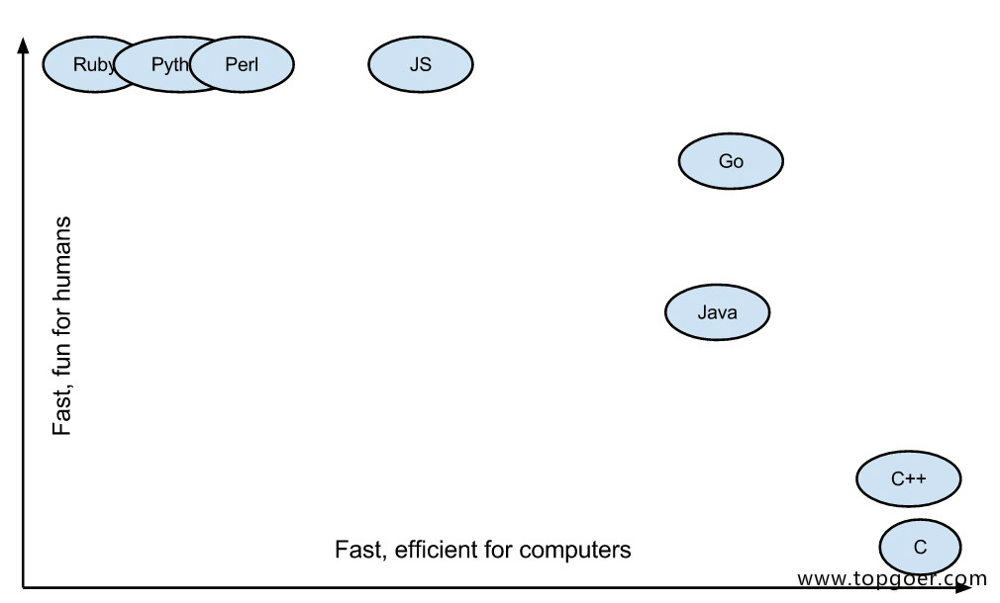

##1. go语言介绍

欢迎大家加我微信大家一起学习 yzy85215215 (需要视频教程也可以加我)

很多小伙伴不知道怎么学习go，需要掌握哪些知识点，据此我找了一个学习线路图go学习线路图

###1.1.1. Go语言为并发而生

go语言（或 Golang）是Google开发的开源编程语言，诞生于2006年1月2日下午15点4分5秒，于2009年11月开源，2012年发布go稳定版。Go语言在多核并发上拥有原生的设计优势，Go语言从底层原生支持并发，无须第三方库、开发者的编程技巧和开发经验。

go是非常年轻的一门语言，它的主要目标是“兼具Python 等动态语言的开发速度和C/C++等编译型语言的性能与安全性”

很多公司，特别是中国的互联网公司，即将或者已经完成了使用 Go 语言改造旧系统的过程。经过 Go 语言重构的系统能使用更少的硬件资源获得更高的并发和I/O吞吐表现。充分挖掘硬件设备的潜力也满足当前精细化运营的市场大环境。

Go语言的并发是基于 goroutine 的，goroutine 类似于线程，但并非线程。可以将 goroutine 理解为一种虚拟线程。Go 语言运行时会参与调度 goroutine，并将 goroutine 合理地分配到每个 CPU 中，最大限度地使用CPU性能。开启一个goroutine的消耗非常小（大约2KB的内存），你可以轻松创建数百万个goroutine。

goroutine的特点：

    1.`goroutine`具有可增长的分段堆栈。这意味着它们只在需要时才会使用更多内存。
    2.`goroutine`的启动时间比线程快。
    3.`goroutine`原生支持利用channel安全地进行通信。
    4.`goroutine`共享数据结构时无需使用互斥锁。

###1.1.2. Go语言简单易学
###语法简洁

Go 语言简单易学，学习曲线平缓，不需要像 C/C++ 语言动辄需要两到三年的学习期。Go 语言被称为“互联网时代的C语言”。Go 语言的风格类似于C语言。其语法在C语言的基础上进行了大幅的简化，去掉了不需要的表达式括号，循环也只有 for 一种表示方法，就可以实现数值、键值等各种遍历。

代码风格统一

Go 语言提供了一套格式化工具——go fmt。一些 Go 语言的开发环境或者编辑器在保存时，都会使用格式化工具进行修改代码的格式化，这样就保证了不同开发者提交的代码都是统一的格式。(吐槽下：再也不用担心那些看不懂的黑魔法了…)

开发效率高
开发效率高图

Go语言实现了开发效率与执行效率的完美结合，让你像写Python代码（效率）一样编写C代码（性能）。

###1.1.3. 使用go的公司

Google:https://github.com/kubernetes/kubernetes

Facebook:https://github.com/facebookgo

腾讯
百度

360开源日志系统
https://github.com/Qihoo360/poseidon
###1.1.4. go适合做什么

服务端开发

分布式系统，微服务

网络编程

区块链开发

内存KV数据库，例如boltDB、levelDB

云平台
###1.1.5. 学习Go语言的前景
目前Go语言已经⼴泛应用于人工智能、云计算开发、容器虚拟化、⼤数据开发、数据分析及科学计算、运维开发、爬虫开发、游戏开发等领域。

Go语言简单易学，天生支持并发，完美契合当下高并发的互联网生态。Go语言的岗位需求持续高涨，目前的Go程序员数量少，待遇好。

抓住趋势，要学会做一个领跑者而不是跟随者。

国内Go语言的需求潜力巨大，目前无论是国内大厂还是新兴互联网公司基本上都会有Go语言的岗位需求。

赏