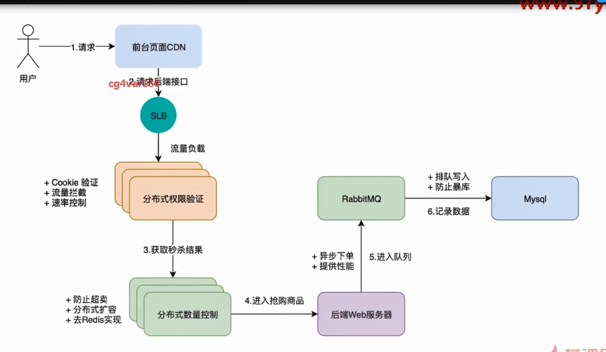

#课程概括
###课程目标
应用Goweb快速构建秒杀系统

全流程应用开发以及架构设计思维梳理

逐级优化，轻松应对“秒杀”以及类似高并发场景
     
       需求整理&系统设计
       知识储备
       RabbitMQ入门
       Iris入门
###我们要做什么
   
  
   
     
###学会的使用工具技术

   
###收货哪些干货
    
   
###课程安排
    基础功能开发
        后端商品管理功能的开啊
        后端订单管理功能的开发
        前台用户登录
        商品展示功能
     性能优化
        架构调优
        前端优化 静态化/cdn
        服务段优化
        安全优化

###主要内容
    需求分析
    需求原型设计
    架构设计
###主要功能

    前台用户登录，商品展示，商品抢购
    后台订单管理
    
###需求圆形设计（墨刀圆形设计）

###系统架构设计
系统需求分析

前端页面需要承载大流量
在大并发的状态下要解决超卖的问题
后端接口满足横向扩展

    cdn-》静态回源
    流量负载
    流量拦截系统
    go服务集群
    rabbitmq
    队列消息服务
    mysql

   
